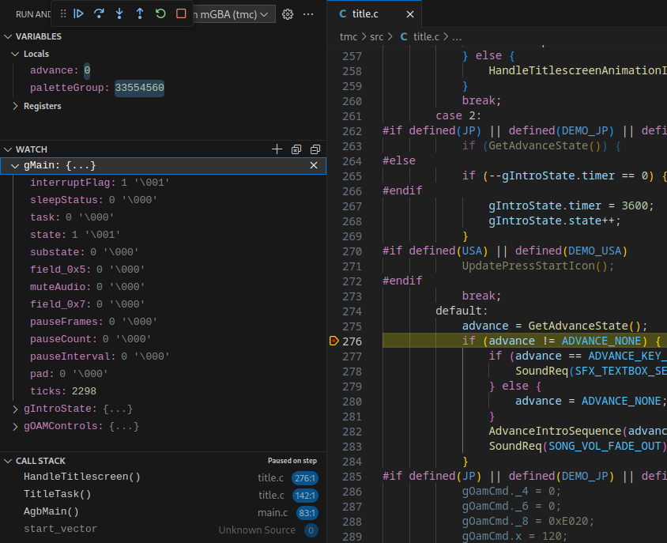

# Debugging using Visual Studio and mGBA

## Setup

To get an .elf file with correct debug symbols you will need to use [my fork of agbcc](https://github.com/octorock/agbcc/tree/dwarf-bugfix) ([PR with relevant changes](https://github.com/pret/agbcc/pull/49)). In `GBA.mk` add `-fdwarf-bugfix` to the `CFLAGS`.

Copy [launch.json](./launch.json) and [tasks.json](./tasks.json) to a `.vscode` folder inside the `tmc` folder. You will need to adapt the path to your `arm-none-eabi-gdb` and `mgba-qt` executables.

You can also use [my fork of mGBA](https://github.com/octorock/mgba/tree/tmc) to immediately start the debugging when mGBA is started using the `-g` argument and to have access to more tmc debugging tools.

## Usage
To start debugging press `F5` or switch to the `Run and Debug` sidebar and start `Debug USA in mGBA`.

It should start mGBA and connect it to the VS Code debugger.

If you add a breakpoint, the debugger should stop at the breakpoint and show you the values of local variables. You can also hover over variables to see their values. To see the values of global variables, add them to the watch window.

You can create a conditional breakpoint by right-clicking on the breakpoint and entering an expression.

You can switch a breakpoint from `Expression` to `Log Message` to output a message to the console every time the code reaches the breakpoint. The message can also print the values of variables to the debug console.

To add a data breakpoint for the variable `foo` go to the debug console and enter `-exec watch foo`.

## References

- https://github.com/mgba-emu/mgba/issues/1391#issuecomment-487230987
- https://github.com/mgba-emu/mgba/issues/1391#issuecomment-1028318570
- https://thomas.trocha.com/blog/gameboy-advanced-setup/
- https://github.com/JamieDStewart/GBA_VSCode_Basic
- https://github.com/JoshThibado/Advanced_Linux_Setup
